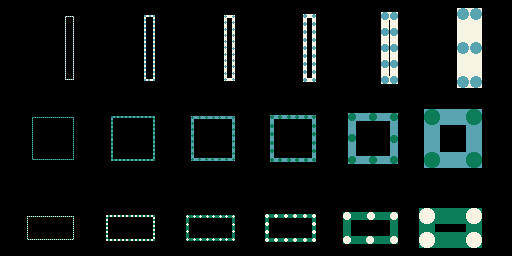

## Uneven spaces in dotted border

The first version of the code always places 4 dots in the corners.
While it's not always possible to use even gaps and dots (for this,
the dot diameter should divide the perimeter of the border, more
precisely `border_size` in the code), trying to place a dot in the
corner worsens the problem (now the dot diameter has to divide the
length and height of the border).

If not only dots but also spaces were accepted in the corners:

- for a dot diameter of 1px (so a border width of 1px), it should be
possible to have even gaps in 100% of the cases instead of 50%
- for a dot diameter of 2px, it should be possible to have even gaps
in 50% of the cases instead of 25%
- for a dot diameter of 3px, it should be possible to have even gaps
in 33% of the cases instead of 17%
- ...

So there would be less visual artefacts. However not drawing a dot in
the corner might look weird for larger border widths, so there should
be an explicit threshold.

The original code had this result :


While the new version uses a different algorithm for border widths of 1 and 2 px:



## Dotted border alignment

test code sha: ec6cfb16cfd1ab0ef81f9b06369c83fe1ebb0baf

The following screenshots show that the dotted border is well aligned
with the existing regular border.

The set of rectangle was drawn using a regular and a dotted border
for the 3 existing border alignments, using the code in this repo and
the command line:
```
EG_SIMULATOR_DUMP=screenshots/alignment_center.png cargo +nightly run
```

- center alignment


- inside alignment


- outside alignment
