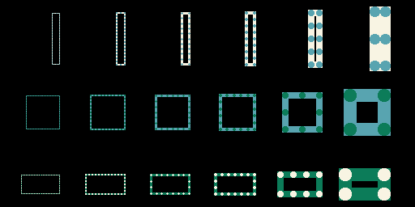
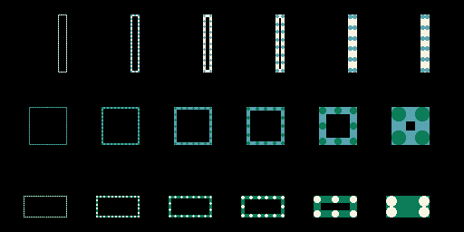
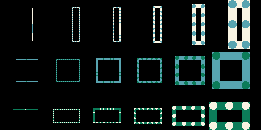

The following screenshots show that the dotted border is well aligned
with the existing regular border.

The set of rectangle was drawn using a regular and a dotted border
for the 3 existing border alignments, using the code in this repo and
the command line:
```
EG_SIMULATOR_DUMP=screenshots/alignment_center.png cargo +nightly run
```

- center alignment


- inside alignment


- outside alignment
